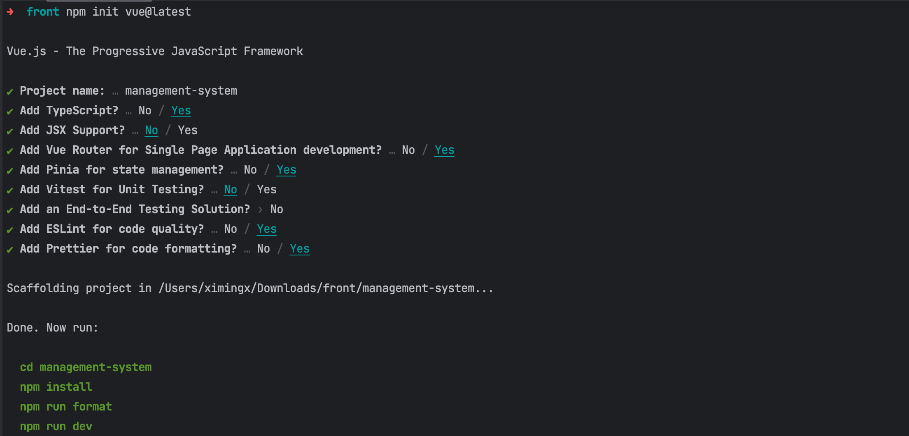
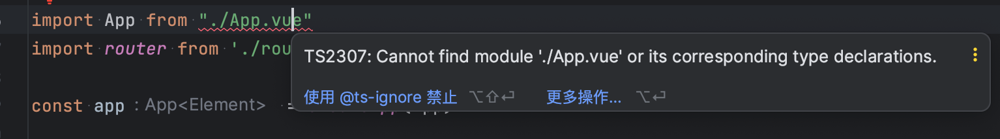

# 


##


###  1. 

初始化项目

```bash
$ npm init vue@latest
```



安装依赖

```bash
$ npm install
```

### 解决vue文件类型未找到



```tsx
// env.d.ts
declare module '*.vue' {
  import { DefineComponent } from 'vue'
  const component: DefineComponent
  export default component
}
```

